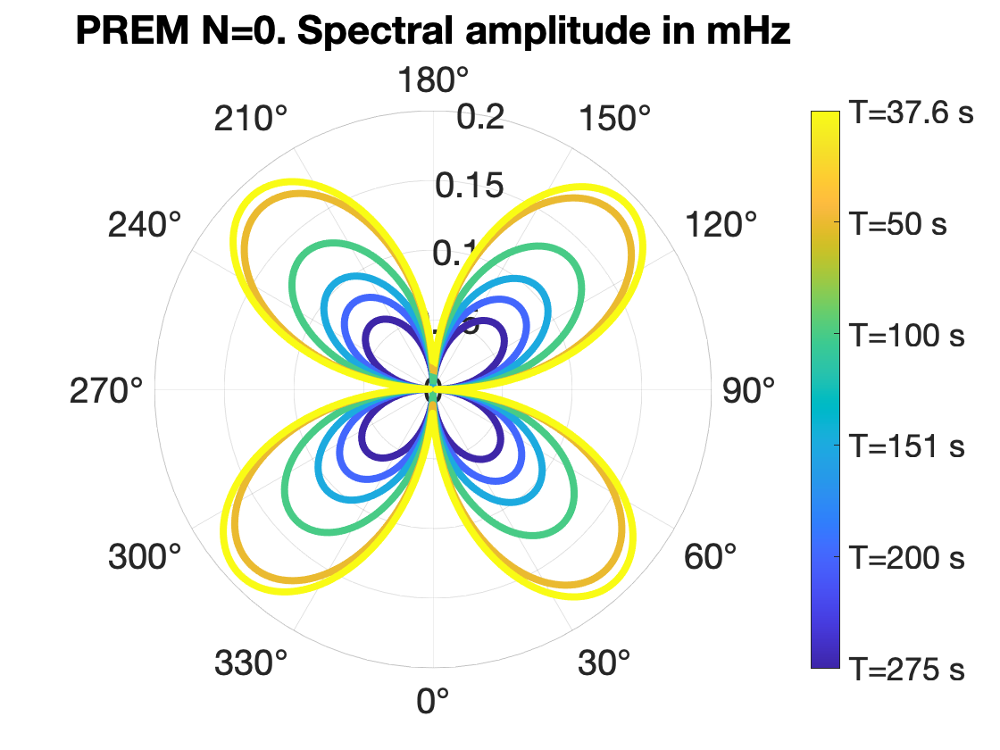

# radpat_overtones

Program to calculate Rayleigh wave radiation patterns for the fundamental mode and overtones.
It calls [MINEOS](https://github.com/geodynamics/mineos) to calculate eigenfunctions but returns them in a buffer without writing files.
Contains a matlab script to plot an example radiation pattern.

## Installation

Build system is configured by [cmake](https://cmake.org/).

```bash
mkdir build
cd build
cmake ..
make
```

This will produce the `rapid_mineos` executable in the `build` directory, which takes a path to a model file and output directory as arguments

## Usage

From the `build` directory, run

```bash
./radpat_overtones <input_model> <jcom> <n> <l> <evnam> <input_azimuth> <output_directory>
```
input model = 1D model in mineos format e.g. prem_noocean.txt
jcom = motion type. 3=sph, 2=tor
n = radial order. 0=fundamental mode, 1+ = overtone number
l = angular order
envam = input event code, e.g. 202201281114A from IRIS.
outdir_directory = path to store output file

e.g.
```bash
./radpat_overtones prem_noocean 3 0 271 202201281114A 70 /data/will/rad_pat/
```

The figure below shows the example above for the angular orders 028,043,061,098,202,271, as in the plot_radpat.m

